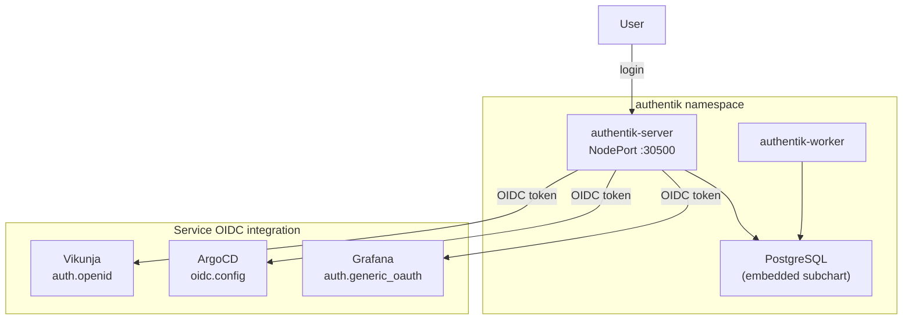
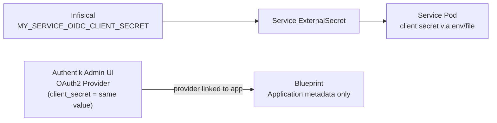

# Authentik (SSO / Identity Provider)

Authentik provides **Single Sign-On (SSO)** for the homelab via **OpenID Connect (OIDC)**. One login, one password for Grafana, ArgoCD, and Vikunja.

## Access

| Interface | URL | Credentials |
|---|---|---|
| Authentik Admin | `https://holdens-mac-mini.story-larch.ts.net` | akadmin / `AUTHENTIK_BOOTSTRAP_PASSWORD` from Infisical |
| Authentik (local) | `http://localhost:30500` | same |

## Architecture



## Directory Contents

| File | Purpose |
|------|---------|
| `kustomization.yaml` | Lists resources for Kustomize/ArgoCD rendering |
| `external-secret.yaml` | `ExternalSecret` that pulls Authentik secrets from Infisical → `authentik-secret` |
| `blueprints-configmap.yaml` | Authentik Blueprint: application entries for portal (bookmarks + OIDC apps) |

> **Note:** Authentik is deployed via the **Helm chart source** defined in `k8s/apps/argocd/applications/authentik-app.yaml`. This directory only contains the ExternalSecret that provides credentials to the Helm release. The `authentik-config` ArgoCD Application syncs this directory, while the `authentik` Application syncs the upstream Helm chart.

## Security

Authentik's server and worker pods run as non-root users. The pod-level securityContext is configured with:

- `runAsUser: 1000`
- `runAsGroup: 1000`
- `runAsNonRoot: true`
- `fsGroup: 1000`

These settings ensure compliance with the cluster's restricted Pod Security Standard. The embedded PostgreSQL instance also runs as a non-root user (UID 999).

## OIDC Providers

Each service has a dedicated OIDC provider in Authentik with its own client ID and secret:

| Service | Client ID | Redirect URI | Secret location |
|---|---|---|---|
| Grafana | `grafana` | `https://holdens-mac-mini.story-larch.ts.net:8444/login/generic_oauth` | Infisical: `GRAFANA_OAUTH_CLIENT_SECRET` |
| ArgoCD | `argocd` | `https://holdens-mac-mini.story-larch.ts.net:8443/auth/callback` | Terraform: `argocd_oidc_client_secret` |
| Vikunja | `vikunja` | `https://holdens-mac-mini.story-larch.ts.net:8449/auth/openid/authentik` | Infisical: `VIKUNJA_OIDC_CLIENT_SECRET` |

All providers use **RS256** signing (asymmetric keys). Scope mappings assigned: `openid`, `email`, `profile`.

## Authentication Model

All services enforce SSO-only access — local login forms are disabled:

| Service | How SSO is enforced |
|---|---|
| ArgoCD | `configs.cm.admin.enabled: false` — admin login disabled, RBAC default `role:admin` for all SSO users |
| Grafana | `auth.disable_login_form: true`, `auto_login: true` — auto-redirects to Authentik |
| Vikunja | `service.enableregistration: false` — local registration disabled, OIDC login available via config file |

## Configuration

Authentik is deployed via ArgoCD using the Helm chart source. All configuration is in `k8s/apps/argocd/applications/authentik-app.yaml`.

Key settings:

- **Helm chart:** `authentik/authentik` v2025.12.4
- **PostgreSQL:** Embedded subchart with 2Gi PVC
- **Secrets:** All sensitive values (secret key, bootstrap password/token, PG password) come from Infisical via ExternalSecret
- **NodePort:** 30500 (HTTP), 30501 (HTTPS)
- **Tailscale Serve:** Default HTTPS port (443)

### Secrets in Infisical

| Key | Purpose | Consumed by |
|---|---|---|
| `AUTHENTIK_SECRET_KEY` | Cookie signing and unique user IDs (never change after first install) | Authentik server/worker |
| `AUTHENTIK_BOOTSTRAP_PASSWORD` | Initial admin password | Authentik server |
| `AUTHENTIK_BOOTSTRAP_TOKEN` | API token for automation | Authentik server |
| `AUTHENTIK_POSTGRES_PASSWORD` | Embedded PostgreSQL password | Authentik server + PostgreSQL |

### OIDC integration per service

All OIDC providers are created via the Authentik Admin UI. The blueprint only manages application metadata (name, icon, group, launch URL). Provider linking is done manually in the UI after creation.

**Grafana** — Client-side configured in Helm values (`monitoring-app.yaml`) via `grafana.ini.auth.generic_oauth`. Client secret mounted from `grafana-secret` ExternalSecret.

**ArgoCD** — Client-side configured in Terraform (`argocd.tf`) via `configs.cm.oidc.config`. Client secret stored in `argocd-secret` via Terraform `set_sensitive`. Requires `terraform apply` to update.

**Vikunja** — Client-side configured via `config.yml` ConfigMap mounted at `/etc/vikunja/config.yml`. Client secret mounted from `vikunja-db-secret` ExternalSecret as a file at `/secrets/oidc-client-secret`.

## Networking

| Layer | Value |
|---|---|
| Container port | 9000 (HTTP), 9443 (HTTPS) |
| NodePort | 30500 (HTTP), 30501 (HTTPS) |
| Tailscale HTTPS | 443 (default) |
| URL | `https://holdens-mac-mini.story-larch.ts.net` |

One-time Tailscale Serve setup:

```bash
tailscale serve --bg http://localhost:30500
```

## Application Inventory

| Application | Integration | URL |
|---|---|---|
| Grafana | `auth.generic_oauth` | `https://holdens-mac-mini.story-larch.ts.net:8444` |
| ArgoCD | `oidc.config` | `https://holdens-mac-mini.story-larch.ts.net:8443` |
| Infisical | Bookmark | `https://holdens-mac-mini.story-larch.ts.net:8445` |
| OpenClaw | Bookmark | `https://holdens-mac-mini.story-larch.ts.net:8447` |
| Trivy Dashboard | Bookmark | `https://holdens-mac-mini.story-larch.ts.net:8448` |
| Vikunja | OIDC (`auth.openid`) | `https://holdens-mac-mini.story-larch.ts.net:8449` |
| Homelab Docs | Bookmark | `https://holdennguyen.github.io/homelab` |

## Adding a new Bookmark Application

For services without native OIDC support, you can add them to the Authentik portal as a Bookmark Application using the Blueprint system.

1. Edit `k8s/apps/authentik/blueprints-configmap.yaml`
2. Add a new entry to the `entries` list under the `bookmarks.yaml` key:

```yaml
      - model: authentik_core.application
        id: app-my-service
        state: present
        identifiers:
          slug: my-service
        attrs:
          name: My Service
          group: Development # Or whatever logical group makes sense
          meta_launch_url: https://url-to-service
          meta_icon: https://url-to-icon.png
          meta_description: Short description of the service
          meta_publisher: Homelab
```

3. Commit and push the changes. ArgoCD will sync the new ConfigMap, and Authentik will automatically discover and apply the Blueprint, making the bookmark appear in the portal.

## Adding a new OIDC-protected service

OIDC providers are created in the **Authentik Admin UI**, consistent with how ArgoCD and Grafana are set up. The client secret is stored in Infisical and delivered to the service via ExternalSecret. The blueprint manages only application metadata (name, icon, group).

### How it works



### Step-by-step checklist

#### 1. Generate and store the client secret in Infisical

Generate a random secret and add it to Infisical under `homelab / prod /` (root path):

| Key | Example |
|---|---|
| `MY_SERVICE_OIDC_CLIENT_SECRET` | (random 64-char alphanumeric string) |

#### 2. Create the OAuth2 provider in Authentik UI

1. Open Authentik Admin → **Applications** → **Providers** → **Create**
2. Select **OAuth2/OpenID Provider**
3. Configure:

| Field | Value |
|---|---|
| Name | `my-service` |
| Authentication flow | (leave default) |
| Authorization flow | `default-provider-authorization-implicit-consent` |
| Client type | Confidential |
| Client ID | `my-service` |
| Client Secret | Paste the same value stored in Infisical |
| Redirect URIs | `https://holdens-mac-mini.story-larch.ts.net:<port>/auth/callback` |
| Signing Key | `authentik Self-signed Certificate` |
| Scopes | `openid`, `email`, `profile` |

4. Save the provider.

#### 3. Link the provider to the application

In Authentik Admin → **Applications** → select the application (created by blueprint) → **Edit** → set **Provider** to the newly created provider → Save.

If the application doesn't exist yet, add it to the blueprint first (see [Adding a new Bookmark Application](#adding-a-new-bookmark-application)), merge, wait for sync, then link.

#### 4. Add the secret to the service's ExternalSecret

In the service's own `external-secret.yaml`, add a mapping for the Infisical key:

```yaml
    - secretKey: OIDC_CLIENT_SECRET
      remoteRef:
        key: MY_SERVICE_OIDC_CLIENT_SECRET
```

#### 5. Configure the service to use OIDC

Mount the secret as a file or env var and configure the service's OIDC settings. Authentik endpoints are auto-discovered from:

```
https://holdens-mac-mini.story-larch.ts.net/application/o/<slug>/.well-known/openid-configuration
```

Standard Authentik endpoints:
- **Authorize:** `https://holdens-mac-mini.story-larch.ts.net/application/o/authorize/`
- **Token:** `https://holdens-mac-mini.story-larch.ts.net/application/o/token/`
- **Userinfo:** `https://holdens-mac-mini.story-larch.ts.net/application/o/userinfo/`
- **OIDC Discovery:** `https://holdens-mac-mini.story-larch.ts.net/application/o/<slug>/.well-known/openid-configuration`

#### 6. Update documentation

- Add the service to the [OIDC Providers](#oidc-providers) table
- Add the service to the [Authentication Model](#authentication-model) table
- Add the service to the [Application Inventory](#application-inventory) table
- Update the service's own README with OIDC setup notes
- Update `k8s/apps/external-secrets/README.md` with the new secret key

#### 7. Commit, merge, verify

Push changes, create PR, merge to `main`. ArgoCD will sync the service application. After sync:

1. Restart the service pod to pick up the new OIDC config
2. Verify the OIDC discovery URL resolves: `curl -sk https://holdens-mac-mini.story-larch.ts.net/application/o/<slug>/.well-known/openid-configuration`
3. Test login via the service's OIDC button

## Operational Commands

```bash
# Check pod status
kubectl get pods -n authentik

# View server logs
kubectl logs -n authentik -l app.kubernetes.io/component=server --tail=50

# View worker logs
kubectl logs -n authentik -l app.kubernetes.io/component=worker --tail=50

# Check ExternalSecret status
kubectl get externalsecret -n authentik

# Force secret re-sync
kubectl annotate externalsecret authentik-secret -n authentik \
  force-sync=$(date +%s) --overwrite

# Check ArgoCD application status
kubectl get application authentik authentik-config -n argocd
```

## Troubleshooting

| Symptom | Cause | Fix |
|---|---|---|
| "Login failed" on Grafana/ArgoCD | Redirect URI mismatch | Check the redirect URI in Authentik matches exactly (scheme, host, port, path) |
| Authentik returns 502 | Server pod not ready | `kubectl get pods -n authentik` |
| "Invalid client" error | Wrong client_id or secret | Verify the secret in Infisical matches what's in Authentik provider |
| OIDC login button not showing | Config not applied | For ArgoCD: run `terraform apply`; for Grafana/Vikunja: wait for ArgoCD sync |
| 403 `insufficient_scope` on userinfo | Provider missing scope mappings | Assign `openid`, `email`, `profile` scope mappings to the provider in Authentik |
| ArgoCD `malformed jwt: unexpected algorithm HS256` | Provider using HS256 instead of RS256 | Update the provider's signing key to an RS256 keypair in Authentik |
| ArgoCD shows no applications after SSO login | RBAC policy.default is empty | Set `configs.rbac.policy.default: role:admin` in Terraform |
| Provider client_secret mismatch | Infisical value doesn't match Authentik UI | Update the provider's client secret in Authentik UI to match the Infisical value; restart service pod |
| Blueprint not applying after ConfigMap change | Worker hasn't picked up the new ConfigMap | Restart the Authentik worker: `kubectl rollout restart deployment authentik-worker -n authentik` |
