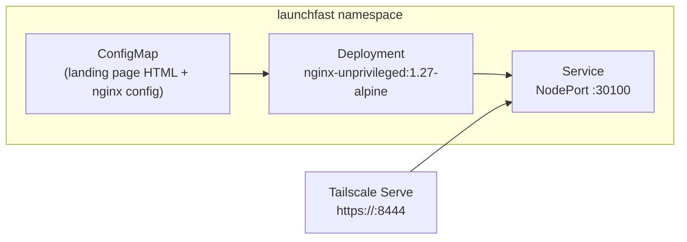

# LaunchFast

A CLI tool that scaffolds a new startup project with best practices — landing page, auth, payments, analytics, CI/CD, and documentation. Built entirely by a multi-agent team coordinated through OpenClaw.

## How It Works

LaunchFast is deployed as a static landing page in the homelab cluster while the product is under development. The full CLI and backend will be developed in a separate repository (`launchfast-dev`) and integrated back into homelab infrastructure as the product matures.



## Directory Contents

| File | Purpose |
|------|---------|
| `kustomization.yaml` | Kustomize resource list |
| `configmap.yaml` | Landing page HTML and nginx configuration |
| `deployment.yaml` | nginx-unprivileged deployment (1 replica, read-only root filesystem) |
| `service.yaml` | NodePort service exposing port 8080 → 30100 |

## Configuration

| Setting | Value |
|---|---|
| Image | `nginxinc/nginx-unprivileged:1.27-alpine` |
| Replicas | 1 |
| Container port | 8080 |
| NodePort | 30100 |
| Pod Security | `restricted` compliant (non-root UID 101, read-only rootfs, no capabilities) |

## Multi-Agent Product Development

This service is the homelab integration point for the LaunchFast product sprint (issue #101). The development is coordinated by OpenClaw agents:

| Agent | Role |
|---|---|
| `homelab-admin` | Orchestrator — tracks progress, coordinates PRs, triggers deployments |
| `product-manager` | Writes PRD, defines features and milestones |
| `devops-sre` | Designs infrastructure (k8s manifests, CI/CD) |
| `software-engineer` | Implements backend (Go/Node) and frontend (React/Next.js) |
| `qa-tester` | Writes test plans and validates functionality |
| `security-analyst` | Reviews for vulnerabilities |

## Accessing the Landing Page

**Via Tailscale Serve (recommended):**

```bash
tailscale serve --bg --https 8444 http://localhost:30100
```

Then visit `https://holdens-mac-mini.story-larch.ts.net:8444` from any Tailscale device.

**Via direct NodePort:**

```bash
curl http://localhost:30100
```

## Roadmap

- [ ] Create `launchfast-dev` GitHub organization and repository
- [ ] Agent-driven architecture planning (PRD, infra design)
- [ ] Backend implementation (Go or Node.js CLI)
- [ ] Frontend implementation (React/Next.js landing + docs)
- [ ] Monitoring dashboards in Grafana
- [ ] Documentation site (MkDocs or standalone)

## Troubleshooting

| Symptom | Cause | Fix |
|---|---|---|
| 502 on landing page | Pod not ready | `kubectl describe pod -n launchfast` — check events |
| Page shows old content | ConfigMap cached | `kubectl rollout restart deployment/launchfast -n launchfast` |
| NodePort unreachable | Networking policy blocking | Verify `allow-tailscale-ingress` policy exists in `launchfast` namespace |
